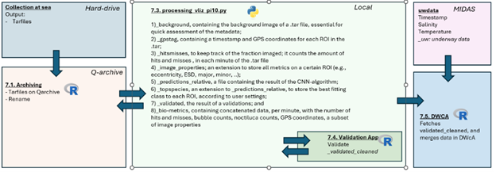

# PI10 TAR Processing Pipeline

This repository contains the **VLIZ Pi10 processing pipeline**, a comprehensive workflow designed to handle `.tar` files generated by the **Plankton Imager 10 (Pi10)** system.  
It automates the **extraction**, **classification**, **metadata analysis**, **validation**, and **integration** of plankton image data into VLIZ’s **MIDAS** data infrastructure.

This work is **based on the iMagine phytoplankton classification module**, but **remade and extended** for the Pi10 application at **VLIZ**, with adaptations for field data, local processing, and validation.  
**Author:** Jonas Mortelmans (VLIZ Data Center)  
**Contributors:** Wout Decrop, VLIZ Data Team

---

## Purpose

The pipeline continuously monitors a source directory for new `.tar` files produced by the Pi10 imaging system and performs a fully automated series of tasks:

- Untars and extracts image data  
- Generates preview images for quick assessment  
- Classifies plankton images using a trained deep learning model  
- Extracts EXIF metadata (GPS, timestamps)  
- Computes morphological features of detected plankton  
- Generates top species predictions  
- Logs per-minute biological and image metrics  
- Sends daily summary reports via email  
- Logs detailed processing times for each step  

---

## Workflow Overview

The pipeline is composed of several stages — from **collection at sea** to **validated data ingestion** in MIDAS.  
It combines Python and R components for full traceability and data quality control.

---

### **1. Collection at Sea**

**Output:** `.tar` files containing raw plankton images and associated metadata.  
These files are generated during Pi10 deployments and stored on a **hard drive**.

---

### **2. Archiving (7.1)**

**Script:** `7.1_Archiving.R`  
**Purpose:**  
- Copies and renames `.tar` files.  
- Archives them on the **Q-archive** for safe long-term storage and retrieval.

---

### **3. Processing (7.3)**

**Script:** `7.3_processing_vliz_pi10.py`  
**Language:** Python  

This is the **core script** — it processes `.tar` files locally, performing all main analytical steps.

**Main Outputs:**
1. `background` — background image of each `.tar` file (for metadata review)  
2. `gpslog` — timestamps and GPS coordinates for each ROI  
3. `hitsmisses` — tracks imaging fractions per minute (hits/misses)  
4. `image_properties` — extracted metrics (eccentricity, FSD, major/minor axis, etc.)  
5. `predictions_relative` — CNN classification results per ROI  
6. `top_species_predictions` — top predictions by probability threshold  
7. `validated_results` — placeholder for human-validated classifications  
8. `bio_metrics` — summarized biological metrics (hits, misses, bubbles, noctiluca, GPS, subset of image metrics)

---

### **4. Validation (7.4)**

**App:** `7.4_Validation_App.R`  
**Purpose:**  
An interactive R Shiny application to **manually validate** and **clean** the CNN-based classifications.  
Allows experts to confirm, adjust, or reject automated predictions.

**Output:**  
- `validated_cleaned` — manually validated dataset.

---

### **5. MIDAS Integration (7.5)**

**Script:** `7.5_DWCA.R`  
**Purpose:**  
- Fetches the validated and cleaned results.  
- Merges them into the **Darwin Core Archive (DwC-A)** format.  
- Uploads to **MIDAS**, VLIZ’s marine data system.

**Final Output:**  
A standardized, validated dataset containing:
- Timestamp and GPS data  
- Environmental parameters (temperature, salinity, etc.)  
- Biological observations linked to Pi10 detections

---

## Environmental Data (MIDAS)

The validated biological data are enriched with **underway environmental data** retrieved from MIDAS (`uwdata`):

- Timestamp  
- Salinity  
- Temperature  
- Additional metadata (e.g., position, vessel data)

This ensures full context for each observation.

---

## Usage

### 1. Environment Setup

Configure a .env file for email notifications:

SMTP_SERVER=smtp.gmail.com
SMTP_PORT=587
SMTP_USERNAME=your_email@gmail.com
SMTP_PASSWORD=your_app_password

---

### 2. Directory Configuration

Update the directory paths inside the main processing script according to your local setup:

source_dir — directory containing .tar files  
work_dir — temporary working directory for extraction and analysis  
quarantine_*_dir — directories for problematic or incomplete files  

---

### 3. Model Configuration

Place the trained model (for example: final_model.h5) and related configuration files in the appropriate folders.

Set key variables inside the script for example to:
TIMESTAMP = "2025-01-01"
MODEL_NAME = "pi10_final_model"

---

### 4. Execution

Run the main Python processing script:

[VLIZ-Pi-10_processing.py](VLIZ-Pi-10_processing.py)
The script will continuously monitor the source directory for new .tar files, automatically process them, and save outputs and logs.

---

## Installation: Exif Metadata Extraction

### Install ExifTool

Windows:
1. Download exiftool(-k).exe from https://exiftool.org/
2. Place it in a folder, for example: C:\ExifTool\
3. Set the path in the script:
   exiftool_path = "C:\\ExifTool\\exiftool.exe"

Linux (Debian/Ubuntu):
sudo apt install libimage-exiftool-perl

macOS:
brew install exiftool

Optional Python Wrapper:
pip install exiftool

Note: The Python wrapper still requires the ExifTool executable to be installed.

---

## Structure

Setup: initializes directories, loads the model and configuration  
Email Scheduler: sends daily summary emails  
Logging: tracks processing time for each step and writes results to CSV  
Main Pipeline: 
- process_tar(tar_file): main function that untars, classifies, extracts metadata, and reports results  
Helper Functions: modular utilities for each processing step  
Continuous Watch: automatically monitors for new .tar files and triggers processing  

---

## Output

Processed .tar files with prediction results and metrics saved in the working directory  
CSV logs containing timestamps, processing times, and biological metrics  
Daily summary emails with key statistics about the processed datasets  

---

## Notes

Files with incomplete data or excessive bubble content are automatically quarantined  
The pipeline is designed to be modular, robust, and easily maintainable  
Each processing step is logged and timestamped for full traceability  

---

## Author

Jonas Mortelmans (VLIZ Data Center)  
Contributors: Wout Decrop (VLIZ)

---

For questions or contributions, please contact the repository maintainer.
